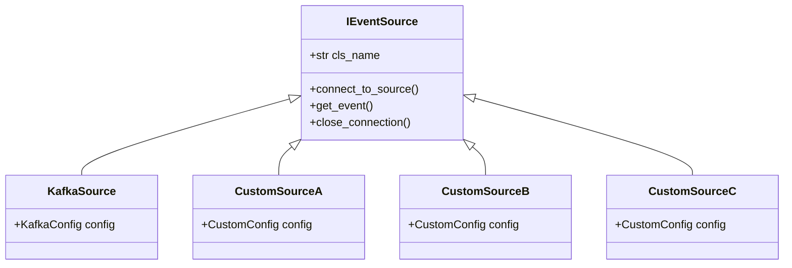

# Event Sources

The dispatch system is agnostic to where the event data comes 
from so long as the source is a subclass of `IEventSource`.  
The `IEventSource` class provides a common interface that is 
used when dispatching events to handlers.  The `IEventSource`
provides setup and teardown mechanics through a context manager.

-----

::: event_stream_processor.domain.interfaces.event_source
    rendering:
        heading_level: 1 
        show_object_full_path: False
        show_category_heading: True
        show_source: True