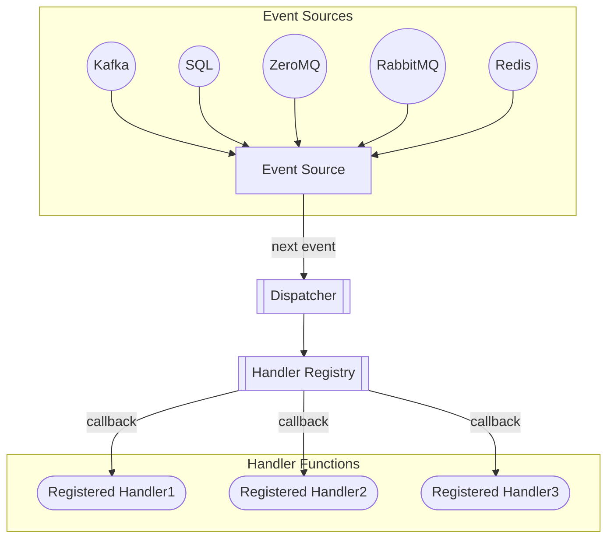

# Event Dispatcher

The [Event Source Pattern](https://docs.microsoft.com/en-us/azure/architecture/patterns/event-sourcing)
provides a way for applications to communicate to other systems through a series
of events.  Each event contains state change data.  Downstream services can listen 
for these events and take action when they are received.

The `Dispatch` class provides a mechanism for subscribing our custom functions
to these events.  The dispatcher reads events from a source and then 
propagates them to registered callback functions.  

