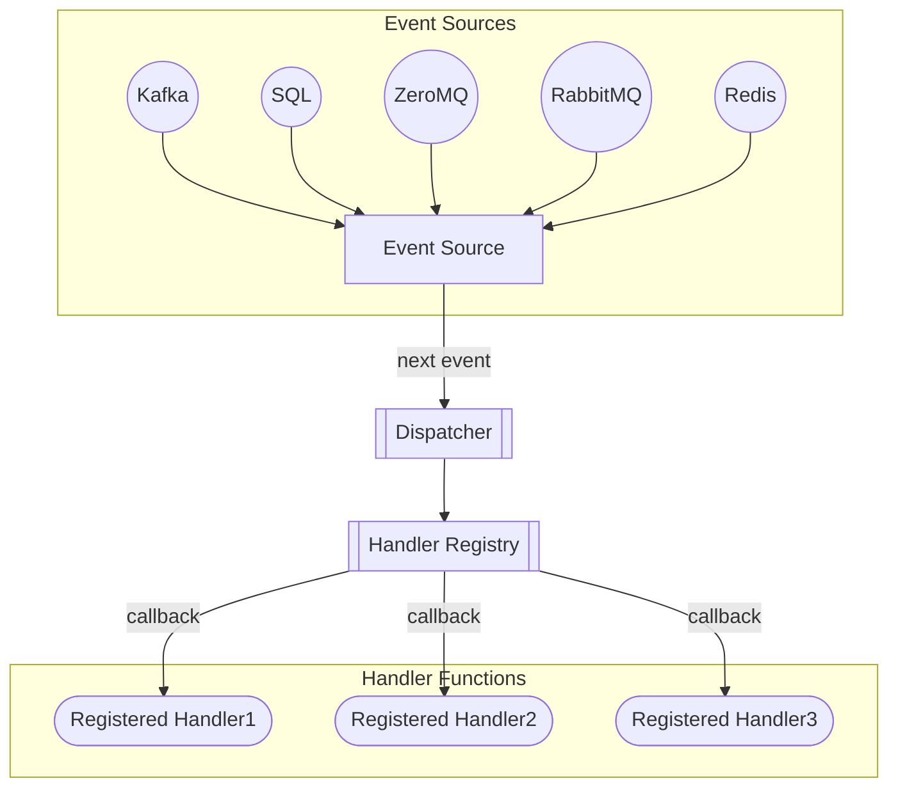

# Event Dispatcher

The [Event Source Pattern](https://docs.microsoft.com/en-us/azure/architecture/patterns/event-sourcing)
provides a way for applications to communicate to other systems through a series
of events.  Each event contains state change data.  Downstream services can listen 
for these events and take action when they are received.

The `Dispatch` class provides a mechanism for subscribing our custom functions
to these events.  The dispatcher reads events from a source and then 
propagates them to registered callback functions.  




## Development Notes
Requirements
 - [poetry](https://python-poetry.org/)

This project uses [poetry](https://python-poetry.org/) for dependency management.  To 
install project dependencies run the following command in the project directory:
```shell
poetry install
```
see [poetry's basic usage](https://python-poetry.org/docs/basic-usage/#installing-dependencies-only)
for more information


### Generate Documentation
You can build a local copy of the docs by running the following command:
```shell
mkdocs build
```

### Git Hooks
You can add the project's git hooks to your local configuration by running the 
following command:
```shell
git config --local core.hooksPath .githooks/
```


